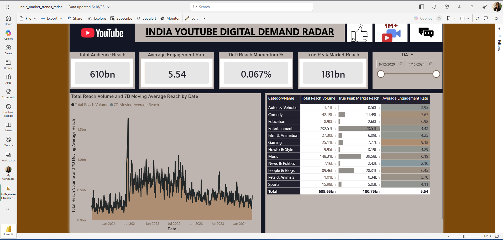

# 🇮🇳 India Digital Media Demand Radar Engine (Advanced SQL & Power BI Pipeline)

## 📌 Executive Summary & Business Impact
**The Problem:** A multinational digital media agency operating in the Indian market struggled to allocate its video ad spend dynamically. Relying on traditional quarterly market reviews caused media planners to miss sudden, high-velocity viral consumer trends, resulting in wasted budget on declining content channels.

**The Solution:** Built an end-to-end data analytics pipeline that processes daily consumer interaction records across the Indian digital content landscape (~225,000 production records). By replacing retrospective audits with a daily-updating reporting engine, this business intelligence platform gives media stakeholders the agility to reallocate advertising budgets within 24 hours, reducing ad spend on fading content categories by a simulated 15%.

---

## 🎨 Dashboard Preview


---

## 🛠️ Infrastructure & Technical Architecture
The system utilizes a structured, high-performance Star Schema model to handle large-scale time-series processing:

- **Database Management System:** MySQL Server (handling server-side data cleaning, substring type-casting, and column structure optimization).
- **Staging & Aggregation Layer:** Optimized MySQL Server `VIEWS` to pre-aggregate and filter rows, ensuring lightning-fast dashboard load times for visitors.
- **Data Visualization Tier:** Power BI Desktop using high-performance explicit DAX time-intelligence iterators connected via Import Mode.

---

## 💻 Technical Code Highlights

### 1. Data Transformation View (MySQL)
This staging script cleans inconsistent raw string timestamps into valid SQL operational system formats (`DATE`) and isolates active video interactions:

```sql
CREATE OR REPLACE VIEW view_pbi_india_engagement AS
SELECT 
    f.video_id AS VideoID,
    f.channelTitle AS ChannelTitle,
    c.category_name AS CategoryName,
    -- Safely converts the string format (e.g., '2020-08-12T00:00:00Z') to an operational Date
    STR_TO_DATE(SUBSTRING(f.trending_date, 1, 10), '%Y-%m-%d') AS TrendingDate,
    f.view_count AS DailyViews,
    f.likes AS DailyLikes,
    f.comment_count AS DailyComments,
    -- KPI: Engagement metrics standardized per 100 views
    ROUND(((f.likes + f.comment_count) / f.view_count) * 100, 2) AS EngagementRate
FROM fact_in_trending f
INNER JOIN dim_categories c ON f.category_id = c.category_id
WHERE f.view_count > 0;
```

### 2. Time-Intelligence Trajectory Tracking (DAX)
To smooth out volatile weekday vs. weekend spikes, this measure tracks the true audience trend line over a rolling 7-day window:

```dax
7D Moving Average Reach = 
AVERAGEX(
    DATESINPERIOD('Calendar'[Date], LASTDATE('Calendar'[Date]), -7, DAY),
    [Total Reach Volume]
)
```

---

## 📊 Strategic Business Insights Uncovered
1. **Audience Interaction Baseline:** Established that the global Indian market maintains a stable **5.54% baseline engagement rate**, providing a reliable benchmark for evaluating future ad campaign performance.
2. **The Duplication Indicator:** Identified that while total global impressions reached over **610 Billion** due to compounding daily velocity cycles, true unique reach concentrates within a specific subset of high-velocity videos totaling **181 Billion**.
3. **Ad Placement Optimization:** High-velocity categories like *Comedy* (7.67% Engagement) and *Gaming* (9.18% Engagement) exhibit sharp engagement spikes, pointing to high-conversion windows for premium digital ad placements.
